# АСУ академия

**Руководство пользователя**  
*Версия 1.0*

---

## Содержание

1. [Введение](#введение)
2. [Начало работы](#начало-работы)
3. [Главное меню](#главное-меню)
4. [Учебные материалы (лекции)](#учебные-материалы-лекции)
5. [Тренировочные сценарии](#тренировочные-сценарии)
6. [Тестирование знаний](#тестирование-знаний)
7. [Результаты обучения](#результаты-обучения)
8. [Прогресс и достижения](#прогресс-и-достижения)
9. [Заключение](#заключение)

---

## Введение

**АСУ академия** – это учебное мобильное приложение, разработанное в рамках учебной практики для изучения автоматизированных систем управления (АСУ), программируемых логических контроллеров (ПЛК), SCADA-систем, промышленных сетей и смежных технологий.

### Основные возможности

- **Лекции** – 16 лекций по ключевым темам автоматизации
- **Сценарии** – 15 практических сценариев с разбором действий
- **Тесты** – 15 тестов по 5 вопросов для проверки знаний
- **Статистика** – детальная статистика и анализ ошибок
- **Достижения** – 13 достижений для мотивации обучения

---

## Начало работы

### Системные требования

- **Операционная система**: Android 9.0 (API 28) или выше
- **Свободное место**: 100 МБ
- **Интернет**: требуется только для просмотра видео

### Установка приложения

1. Скопируйте файл `app-release.apk` на устройство
2. Откройте файл и подтвердите установку
3. После установки запустите приложение из меню приложений

  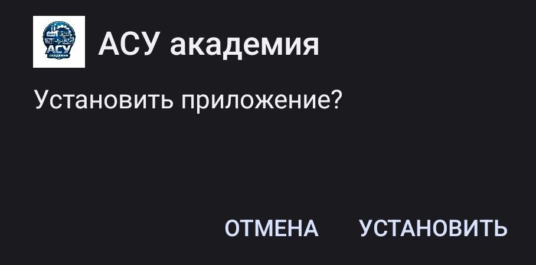

---

## Главное меню

После запуска приложения открывается главный экран с пятью основными разделами.

### Как работать с главным меню

- Нажмите на любую карточку, чтобы перейти в соответствующий раздел
- В верхней части экрана отображается название приложения
- Каждая карточка имеет уникальный цвет и иконку для быстрой навигации

**Разделы главного меню:**

- **Учебные материалы** – изучение теоретических лекций
- **Тренировочные сценарии** – практические задания
- **Тестирование знаний** – проверка усвоенного материала
- **Результаты** – просмотр статистики и ошибок
- **Прогресс** – отслеживание достижений

  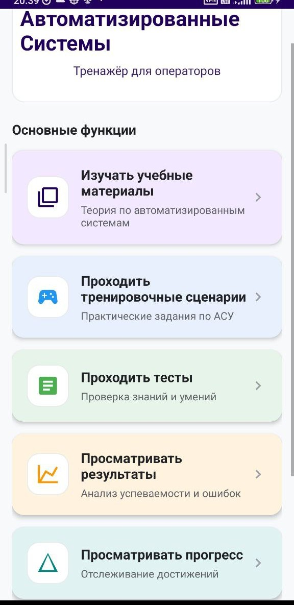

---

## Учебные материалы (лекции)

Раздел содержит 16 подробных лекций по различным темам автоматизации.

### Список доступных лекций

1. Введение в АСУ
2. SCADA-системы
3. Программируемые логические контроллеры (ПЛК)
4. Человеко-машинный интерфейс (HMI)
5. Промышленные сети и протоколы
6. Датчики и измерительные преобразователи
7. Исполнительные механизмы
8. PID-регулирование
9. Аварийная защита (ESD, SIL)
10. MES и ERP в промышленности
11. Кибербезопасность АСУ
12. IIoT и Индустрия 4.0
13. Автоматизация в энергетике
14. Автоматизация в пищевой промышленности
15. Автоматизация в нефтегазовой отрасли
16. Валидация и тестирование АСУ

### Как работать с лекциями

#### Шаг 1. Выбор лекции

- На главном экране нажмите **"Изучать учебные материалы"**
- Откроется список всех доступных лекций с указанием темы
- Выберите интересующую лекцию, нажав на неё

  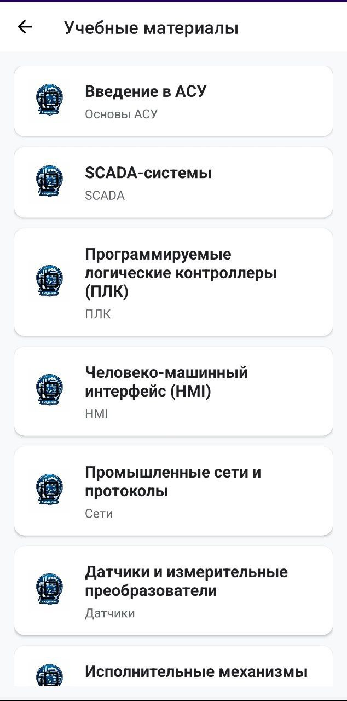

#### Шаг 2. Чтение лекции

На экране лекции отображается:

- Заголовок лекции
- Подробный теоретический материал, разбитый на разделы
- Блок **"Важно знать"** с ключевыми фактами (уникален для каждой лекции)

  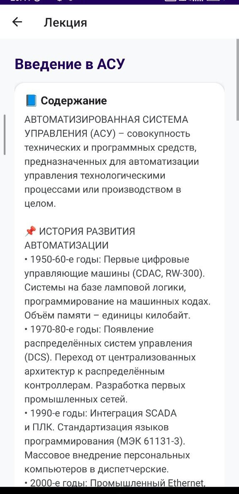

#### Шаг 3. Просмотр видео (если доступно)

> **Важно:** Для просмотра видео может потребоваться подключение к VPN, так как некоторые видеохостинги могут быть недоступны в вашем регионе.

- Если к лекции прилагается видео, вы увидите блок с YouTube-плеером
- Видео можно развернуть на весь экран, нажав на кнопку в правом нижнем углу плеера
- При повороте устройства видео автоматически подстраивается под ориентацию экрана

  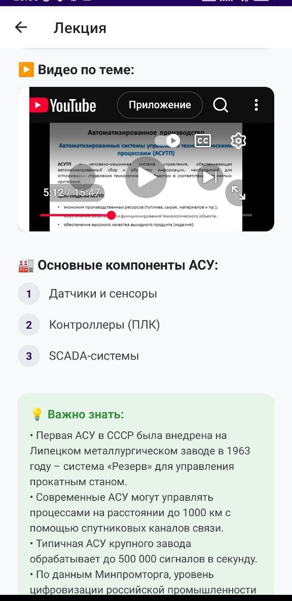

#### Шаг 4. Переход к тестированию

- Внизу экрана есть кнопка **"Перейти к тестированию"**
- Нажмите её для быстрого перехода к списку тестов по изученной теме

  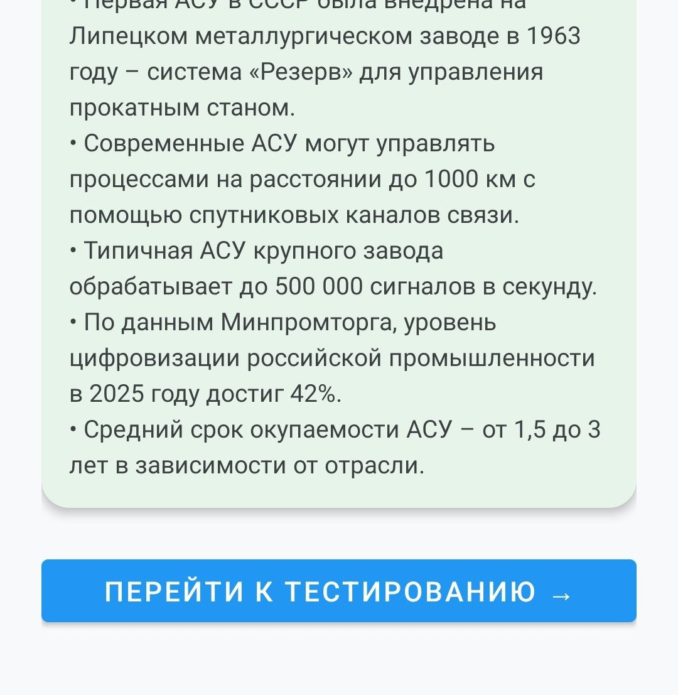

---
## Тестирование знаний

Раздел содержит 15 тестов по 5 вопросов в каждом, с тремя вариантами ответов.

### Как проходить тесты

#### Шаг 1. Выбор теста

- На главном экране нажмите **"Проходить тесты"**
- В списке тестов отображается название и тема каждого теста

  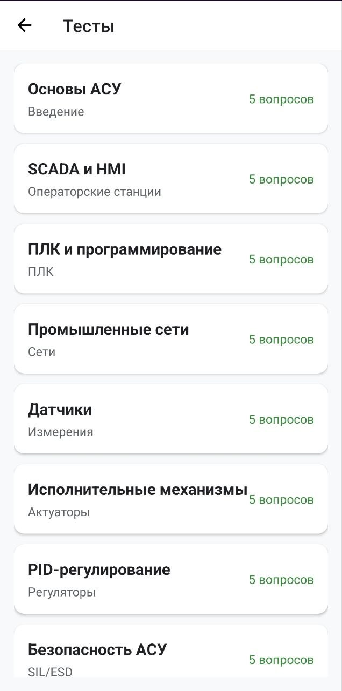

#### Шаг 2. Прохождение теста

На экране теста вы увидите:

- Индикатор прогресса (сколько вопросов пройдено из общего количества)
- Текст текущего вопроса
- Три варианта ответа в виде стилизованных карточек
- Кнопки **"Следующий вопрос"** и **"Завершить тест"**

  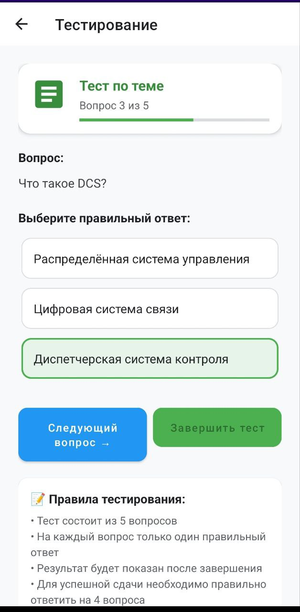

#### Шаг 3. Выбор ответа

- Нажмите на один из трёх вариантов (выбранный вариант подсвечивается зелёной рамкой)
- Ваш ответ автоматически сохраняется

#### Шаг 4. Навигация по вопросам

- После выбора ответа нажмите **"Следующий вопрос"**
- Кнопка **"Завершить тест"** становится активной только на последнем вопросе

#### Шаг 5. Завершение и просмотр результатов

- Ответив на последний вопрос, нажмите **"Завершить тест"**
- Откроется экран с подробными результатами

  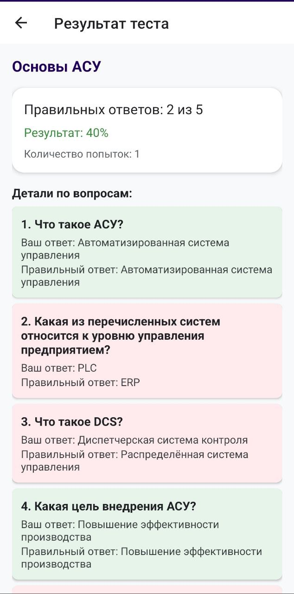

На экране результатов отображается:

- Название пройденного теста
- Количество правильных ответов (например, "4 из 5")
- Процент правильных ответов
- Количество попыток прохождения этого теста
- Подробный разбор по каждому вопросу:
  - Ваш ответ (зелёный – правильно, красный – неправильно)
  - Правильный ответ

#### Шаг 6. Повторное прохождение

- Чтобы пройти тест заново, нажмите кнопку **"🔄 Пройти заново"** внизу экрана
- При повторном входе в тест из списка вы сразу попадёте на экран результатов последней попытки

---

## Тренировочные сценарии

Раздел содержит 15 практических ситуаций, моделирующих реальные задачи оператора АСУ.

### Как работать со сценариями

#### Шаг 1. Выбор сценария

- На главном экране нажмите **"Проходить тренировочные сценарии"**
- Откроется список сценариев, где каждый отмечен уровнем сложности:

  - ★ – лёгкий уровень
  - ★★ – средний уровень
  - ★★★ – сложный уровень

  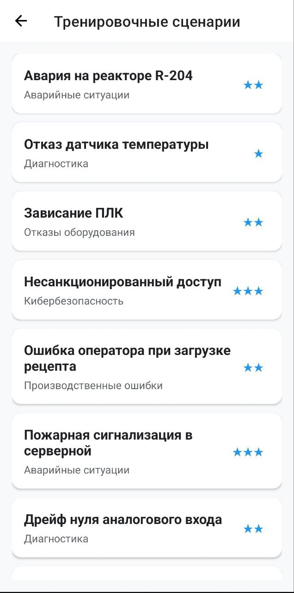

#### Шаг 2. Изучение ситуации

На экране сценария вы увидите:

- Название и описание ситуации
- Чётко сформулированную задачу
- Три варианта действий (A, B, C)

  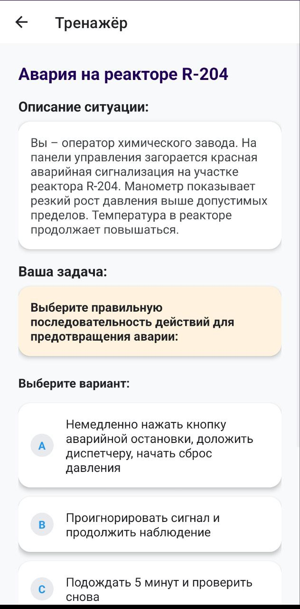

#### Шаг 3. Выбор действия

- Внимательно прочитайте все варианты
- Нажмите на карточку с выбранным вариантом

#### Шаг 4. Получение обратной связи

После выбора сразу появится результат:

- ✅ **Зелёный фон** – правильное решение (подробное объяснение)
- ❌ **Красный фон** – неверное решение (объяснение ошибки)

  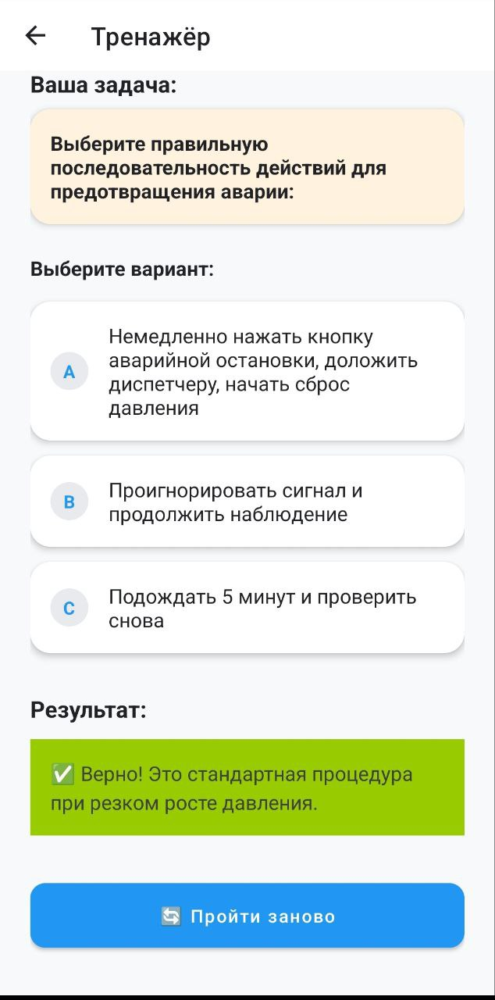

#### Шаг 5. Повторное прохождение

- При первом успешном прохождении сценарий отмечается как пройденный
- Чтобы пройти сценарий снова, нажмите кнопку **"🔄 Пройти заново"** внизу экрана
- Это полезно для закрепления материала и тренировки

---

## Результаты обучения

Раздел предоставляет общую статистику по всем тестам и анализ ошибок.

### Что отображается на экране результатов

#### Общая статистика

- **Попыток** – общее количество всех попыток прохождения тестов
- **Успешность** – средний процент правильных ответов по всем тестам
- **Пройдено тестов** – сколько тестов было хотя бы раз пройдено

  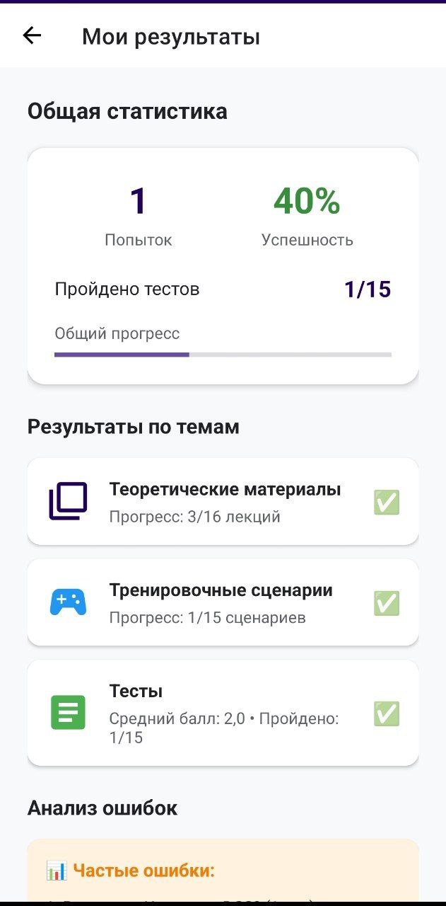

#### Прогресс-бар

- Визуально показывает общую успеваемость в процентах
- Цвет индикатора меняется по мере роста успеваемости

#### Результаты по темам

- **Теоретические материалы** – сколько лекций прочитано
- **Тесты** – средний балл и количество пройденных тестов
- **Тренировочные сценарии** – сколько сценариев выполнено

#### Анализ ошибок

- Автоматически формируется список трёх самых частых ошибок
- Например: *"SCADA: Какая функция НЕ относится к SCADA? (2 раз)"*

#### Рекомендации

Персонализированные советы на основе вашего прогресса:

- "Изучите непрочитанные лекции: осталось 3"
- "Пройдите тесты: осталось 2"
- "Выполните сценарии: осталось 1"

  

---

## Прогресс и достижения

Раздел показывает общий прогресс обучения и все полученные достижения.

### Общий прогресс

- **Круговой индикатор** – показывает общий процент выполнения (усреднение по лекциям, тестам и сценариям)
- Например: 75% – означает, что в среднем пройдено 75% всего материала

  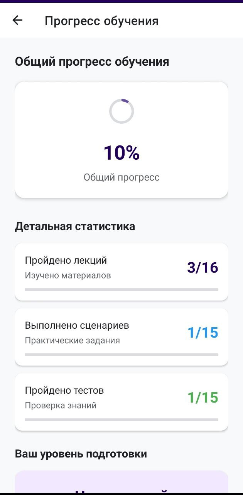

### Детальная статистика

Для каждой категории отображается:

- Количество пройденного (например, "5/16 лекций")
- Линейный индикатор прогресса

### Уровень подготовки

Автоматически рассчитывается на основе общего прогресса:

| Прогресс | Уровень |
|----------|---------|
| 0-29% | Начинающий |
| 30-69% | Средний |
| 70-100% | Эксперт |

### Достижения

В приложении предусмотрено **13 достижений**, которые открываются по мере обучения:

| Достижение | Эмодзи | Как получить |
|------------|--------|--------------|
| Первая лекция | 📘 | Прочитайте любую лекцию |
| Книгочей | 📚 | Прочитайте 5 лекций |
| Эрудит | 🏛️ | Прочитайте все лекции |
| Первая практика | 🔧 | Выполните любой сценарий |
| Практик | ⚙️ | Выполните 5 сценариев |
| Мастер | 🏆 | Выполните все сценарии |
| Первый тест | 📝 | Пройдите любой тест |
| Тестировщик | ✅ | Пройдите 5 тестов |
| Отличник | 🎓 | Пройдите все тесты |
| Идеальный | 🌟 | Получите 100% в любом тесте |
| Первая попытка | 🎯 | Сделайте первую попытку теста |
| Упорство | 💪 | Сделайте 10 попыток тестов |
| Все звёзды | 👑 | Завершите все лекции, сценарии и тесты |

  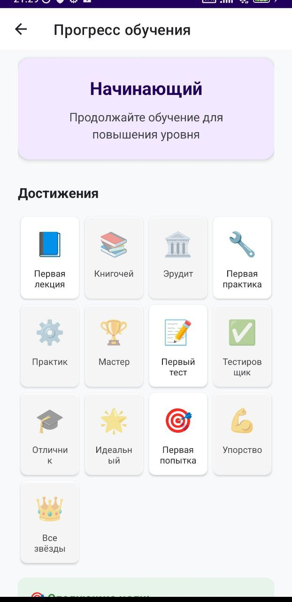

#### Как работают достижения

- **Полученные достижения** отображаются ярко и полноцветно
- **Неполученные** – серые и полупрозрачные
- Нажмите на любое достижение – появится всплывающее окно с описанием условия получения и статусом

  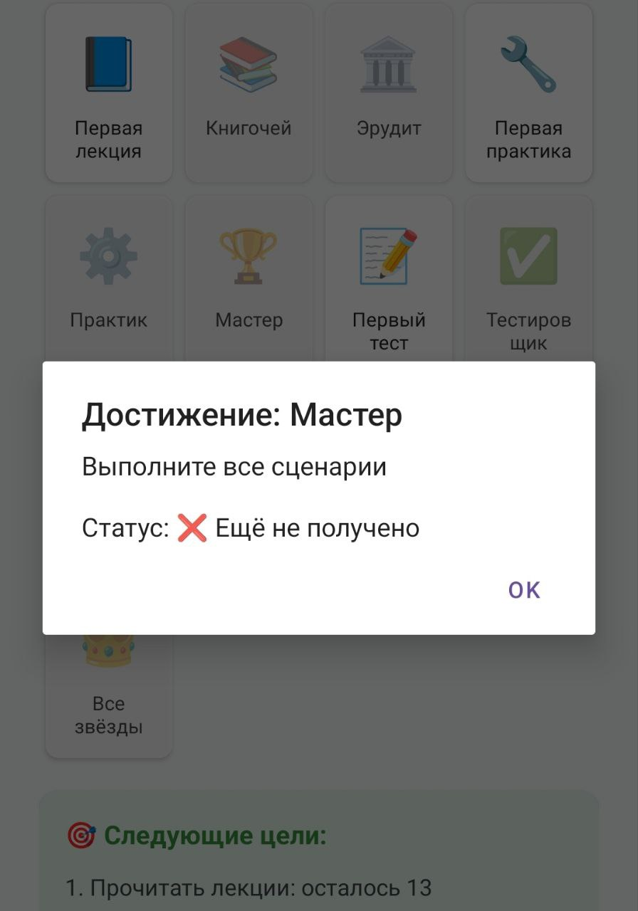

### Следующие цели

На основе вашего прогресса автоматически формируются три ближайшие цели:

- "Прочитать лекции: осталось 2"
- "Пройдите тесты: осталось 3"
- "Выполнить сценарии: осталось 1"

Если все основные цели выполнены, система предложит закрыть оставшиеся достижения.

  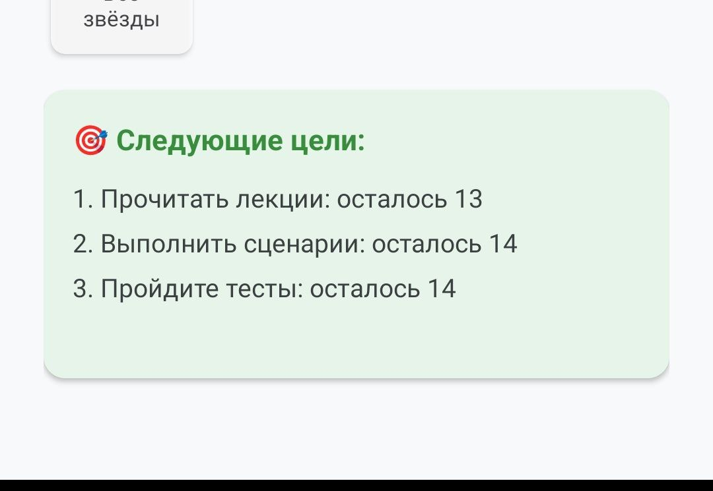

---

## Заключение

Приложение **"АСУ академия"** представляет собой полноценный учебный комплекс для изучения основ промышленной автоматизации. Оно может использоваться как для самостоятельного обучения, так и в рамках учебного процесса в колледжах и техникумах.

### Преимущества приложения

- ✅ **Полностью автономная работа** – интернет требуется только для видео
- ✅ **Интуитивно понятный интерфейс** – разберётся любой пользователь
- ✅ **Наглядная обратная связь** – цветовая индикация и подробные пояснения
- ✅ **Система мотивации** – достижения и отслеживание прогресса
- ✅ **Актуальный контент** – информация соответствует современным стандартам

---

  <strong>АСУ академия</strong> 
  Версия 1.0 | 2026 

